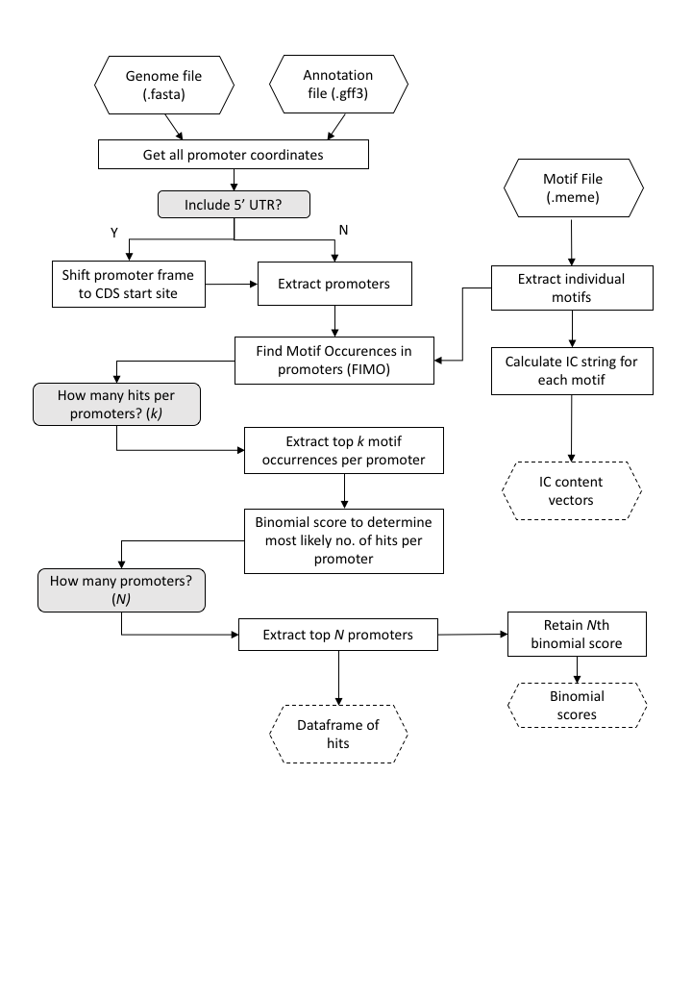
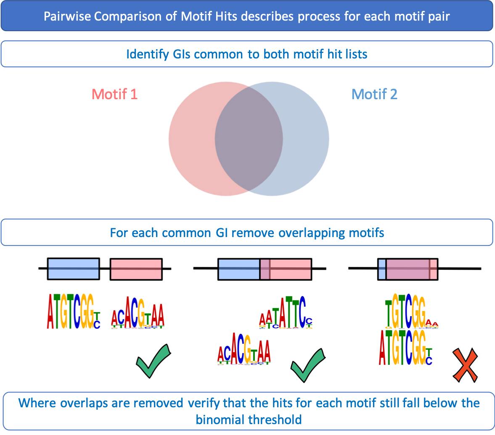
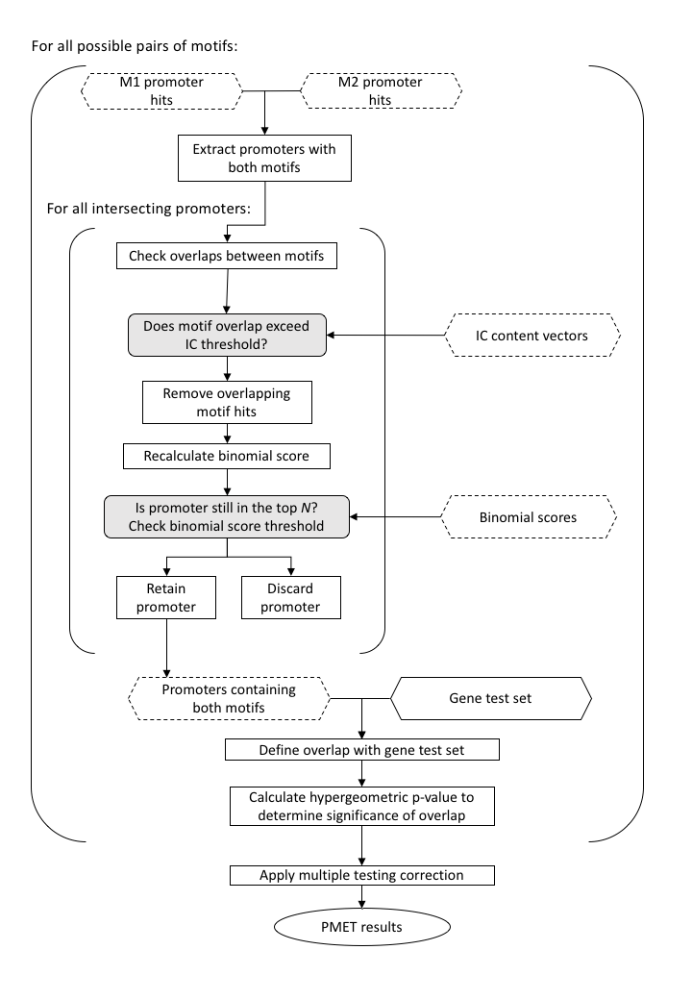

# Paired Motif Enrichment Tool (publication)

A tool for determining the co-localisation of pairs of transcription factor binding motifs within a given set of promoters using a hypergeometric test.

The tool has two parts, part one assigns motifs to promoters and part two assess enrichment of motif pairs.

### Part 1: PMET index
For each motif in the provided motif set, the index uses fimo to assess motif matches within all of the promoters a given length in the provided genome.

Within each promoter, fimo assigns probability scores to all potential matches. In order to determine the 'best' number of matches up to k matches, we combine the probability scores from the fimo output (using a geometric mean) and perform a binomial probability test on the top 1 to top k non-overlapping motif matches. The motif matches corresponding to the best binomial score are retained. The binomial score on the nth promoter is retained as a threshold to determine the score required for a set of motif matches to be in the top n promoters (information which is used later by PMET tool).

Finally the top n promoters for each motif are extracted based on the best binomial scores.

 

The following parameters need to be specified
- promoter length
- max *k* motif matches: max number of motif hits allowed per promoter (recommended: 5)
- top *n* promoters: number of promoters to assign to each motif (recommended: 5000)
- Should the 5' UTR be included? (options: --No or --Yes)
- Should potential overlaps of promoters be removed? (options: --AllowOverlap or --NoOverlap)



##### Comments on the parameters
We recommend the max *k* motif matches should be between 3 and 6 hits, it is well documented that transcription factors sometimes require multiple binding sites in order to bind a promoter [Spitz, F., Furlong, E. Transcription factors: from enhancer binding to developmental control. Nat Rev Genet 13, 613–626 (2012). https://doi.org/10.1038/nrg3207].

The top *n* promoters is a large number to capture as many hits as possible. This does lead to a large number of false positives at this stage, but these are mitigated by a very strong multiple testing correction in the second part of the algorithm.

##### Example call
```
# -r full path of the folder PMET_index, required
# -i gff3 header to use (TAIR 'gene_id='), required
# -p promoter length
# -k maximum motif matches per promoter
# -n number of promoters to assign to
# -j Max number of jobs to run at once
# -v toggle whether to remove promoter overlapping bits with gene sequences (AllowOverlap or NoOverlap)
# -u toggle whether to include 5' UTR sequence (--Yes or --No)
# -o full path to results folder
# $1 - genome
# $2 - gff3
# $3 - MEME-friendly motif input

sh /home/username/PMET/PMET-master/PMET_index/PMETindexgenome.sh \
-r /home/username/PMET/PMET-master/PMET_index/scripts \
-o /home/username/PMET/ds1_output_k5n5k_uYes_index \
-i gene_id= -k 5 -n 5000 -p 1000 -j 10 -u Yes -v NoOverlap \
/home/username/PMET/input/Arabidopsis_thaliana.TAIR10.dna_rm.toplevel.fa \
/home/username/PMET/input/Arabidopsis_thaliana.TAIR10.39.gff3 \
/home/username/PMET/input/ArabidopsisPBM.meme
```
### Part 2: PMET

PMET tests whether a particular pair of motifs is enriched in the gene set being tested compared to the occurrence of that motif pairing across all the promoters.



For each pair of motifs in every promoter in the top *N* promoters, any overlaps between the matches for motif 1 and the matches for motif 2 are identified and the information content of the overlap (based on the motif .meme files) is calculated. If the IC for the overlap in either motif exceeds 4 (indicating that highly conserved bases are likely part of the overlap), then this match is removed from the analysis (from both motifs). This overlap removal filters out highly similar motifs whilst enabling a small amount of motif overlap which has been documented in co-acting transcription factors [citation needed].

The binomial test is repeated for the remaining motif matches and if the motifs still score below the binomial significance threshold for the top *N* promoters then the two motifs are considered to be a co-localised pair.

Finally, the gene lists (clusters) provided by the user are tested for enrichment of the promoters containing both motifs using a pairwise hypergeometric test based on the Matlab function proposed by Meng et al. (2009). The P-values are corrected using a multiple testing correction. Hypergeometric P-values are corrected for the number of motif pairs using Benjamini-Hochberg, Bonferroni (which calculates correction based on each cluster separately) and Global Bonferroni (which calculates a Bonferroni correction across all clusters) corrections. Corrected P-values<0.05 are considered significant.



The user has to provide:
- a set of genes clusters to be tested, in a 2 column tab-delimited text file containing cluster ID in column 1 and genes in column 2.

The following parameters need to be specified
- IC content (recommended value = 4)
- adjusted P-value threshold (recommended value = 0.05)

### example call
```
# -i IC content allowed in overlap (default=4)
# -t significance threshold after multiple testing (default=0.05)
# -p full path of the folder containing the output generated by PMET_index
# -r full path of PMET_tool, required
# -o full path to results folder

sh /home/username/PMET/PMET-master/PMET_tool/PMET_tool_wrapper.sh -i 4 -t 0.05 \
-p /home/username/PMET/ds1_output_k5n5k_uYes_index \
-r /home/username/PMET/PMET-master/PMET_tool/scripts \
-o /home/username/PMET/ds1_output_k5n5k_uYes_tool_i4_t0-05_identity \
/home/username/PMET/ds1_input_files/identity_topN.txt 
```

### Citations
fimo tool - Charles E. Grant, Timothy L. Bailey, and William Stafford Noble, "FIMO: Scanning for occurrences of a given motif", Bioinformatics, 27(7):1017-1018, 2011.
